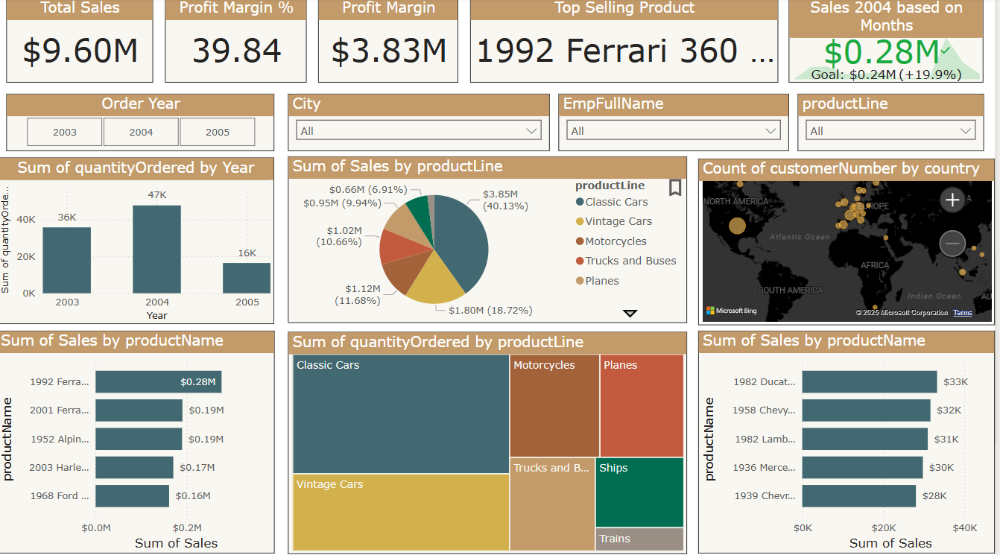
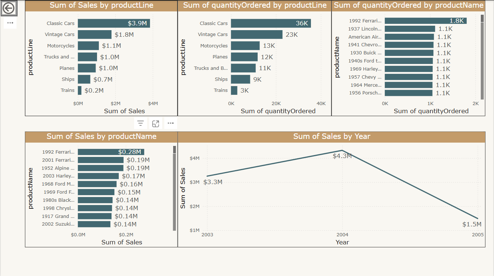

# 🚗 Automotive Sales Dashboard Project

This repository contains interactive business intelligence dashboards created using **SQL** and **Power BI**. The goal is to analyze and visualize automotive sales performance across different years, products, and regions.

---

## 📊 Dashboards Overview

### 1. Sales Performance Overview Dashboard
This dashboard provides a high-level summary of:
- Total sales, profit margin, and profit amount
- Top-selling product (`1992 Ferrari 360 Spider`)
- Year-wise quantity ordered
- Sales by product line and product name
- Customer distribution by country

It enables stakeholders to quickly assess key business metrics and geographical trends.

---

### 2. Product Sales & Quantity Analysis Dashboard
This dashboard gives a deeper breakdown into:
- Sales and quantity ordered by product line and individual products
- Year-over-year sales trends
- Identification of high-volume products based on quantity

It is ideal for product managers or supply chain analysts who need insights on inventory performance and product popularity.

---

## 🛠 Technologies Used

- **SQL**: Data extraction and preprocessing from the database
- **Power BI**: Data modeling and interactive dashboard creation

---

## 📂 Files Included

- `SalesPerformanceOverview.png`: Screenshot of the Sales Performance Overview Dashboard
- `ProductSales&QuantityAnalysis.png`: Screenshot of the Product Sales & Quantity Analysis Dashboard
- `README.md`: Project documentation

---
